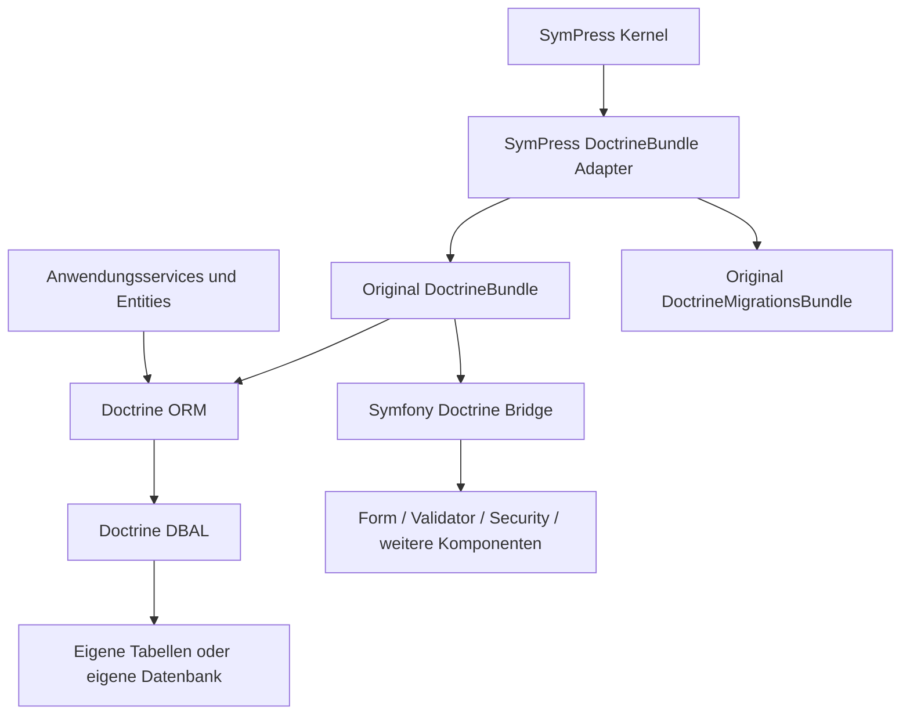

# Doctrine-Integration für SymPress

Status: v1 implementiert; Release-Abnahme in `release-v1.0.0.md` dokumentiert.

## Auftrag und Entscheidung

SymPress erhält mit `sympress/doctrine-bundle` eine eigenständige Integration des
originalen Doctrine-Stacks. Entities, Repositories, Mapping, Abfragen und
Transaktionen verwenden dieselben Klassen wie in Symfony. Der Entwurf übernimmt
keine Architektur und keinen Code aus vorhandenen SymPress-ORM- oder
Migrationspaketen. Die einzigen SymPress-Laufzeitabhängigkeiten sind Kernel und
Framework-Bundle als Integrationsplattform.

Das Repository `SymPress/doctrine-bundle` ist privat. Die erste stabile Version
ist v1.0.0. PHP 8.5 und veröffentlichte, stabile Symfony-8.1-/SymPress-Pakete sind
die Basis. Composer installiert originale upstream Bibliotheken; es gibt keine
kopierten Doctrine-Quellen und keine selbst entwickelte ORM-Schicht.

## Architektur

Zwei schmale Bundle-Adapter ergänzen die vom SymPress-Kernel verlangten
Discovery-Methoden und geben die originalen Container-Extensions zurück. Das
originale Migrations-Bundle ist `final`; DoctrineBundle ist ebenfalls als finale
API dokumentiert. Beide Adapter delegieren deshalb Build, Container-Zuweisung,
Boot und Shutdown an unveränderte Instanzen. Der Doctrine-Adapter deklariert das
Framework- und das Migrations-Bundle über `RequiredBundle`. Discovery registriert
alle Abhängigkeiten vor dem Consumer. Sämtliche Extensions werden vor der
Container-Kompilierung registriert; die ursprünglichen Compiler-Passes und
Service-Definitionen bleiben erhalten.

Optionale Adapter registrieren das originale SecurityBundle und MakerBundle.
Der Security-Adapter ergänzt den nativen Entity-Provider-Factory-Hook für die
SymPress-Registrierungsreihenfolge. Kernel >= 1.1.7 erzeugt frische Compiler-Pass-
Instanzen je Container-Kandidat; dies verhindert verlorene Listener beim zweiten
Compile nach neu gefundenen Ressourcen. Native Ressourcenpfade und Namespaces
bleiben erhalten, während die SymPress-Discovery auf das eigene Paket verweist.

`doctrine` und `doctrine_migrations` bleiben die einzigen fachlichen
Konfigurationsbereiche. Es gibt keine neue SymPress-Konfigurationssprache und
keine verpflichtende WordPress-Verbindung. Die Verbindung wird ausschließlich
über native DBAL-Konfiguration erstellt. `$wpdb`, WordPress-Konstanten und Hooks
werden für die Persistenz weder gelesen noch benötigt.

## Funktionsvertrag der v1

| Bereich | Umsetzung | Abnahmenachweis |
| --- | --- | --- |
| Entities und Mapping | Originale PHP-Attribute, Metadaten und Typen | Mapping und Schema-Validierung |
| EntityManager | Originaler `EntityManagerInterface`, UnitOfWork und Registry | Persistieren, Lesen, Ändern, Löschen |
| Repositories | Originaler `ServiceEntityRepository` und Repository-Factory | Autowiring und benutzerdefinierte Abfrage |
| Abfragen | Originaler QueryBuilder, DQL und native SQL | DQL und parameterisierte Abfragen |
| Beziehungen | Originale Collections, Kaskaden und Lazy Loading | Beziehung nach `clear()` neu laden |
| Transaktionen | Originale DBAL-/ORM-Transaktionssteuerung | Erfolgreicher Commit und fehlgeschlagener Rollback |
| Mehrere Manager | Native benannte Verbindungen und Manager | Getrennte Datenbankbereiche und Registry-Auswahl |
| Erweiterungen | Native Typen, Listener, Middleware, DQL-Funktionen und Filter | Service-Registrierung und Laufzeitverhalten |
| Migrationen | Originales DoctrineMigrationsBundle | Diff, Ausführung, Metadaten und Down-Richtung |
| Schema-Begrenzung | Nativer DBAL `schema_filter` je Verbindung | Fremde Tabellen bleiben außerhalb des Diffs |
| Symfony Bridge | Originale Komponente, optionale Integrationen bleiben nutzbar | UniqueEntity, EntityType und Entity-User-Provider |
| Messenger | Originales optionales `symfony/doctrine-messenger` | Transaktionsmiddleware bei vorhandenem Messenger |
| Console | Native Befehle im SymPress CommandLoader | Befehlsauflistung und echte Ausführung |
| Entwicklungswerkzeuge | Optionales Symfony MakerBundle | Entity- und Migrationsgeneratoren mit Konfiguration |
| Lebenszyklus | Native Shutdown-/Reset-Mechanismen | Geschlossene/geleerte Manager und neue Arbeitseinheit |
| Produktionscontainer | Unveränderte Doctrine-Dienste im Kernel-Cache | Dump und frischer Prozess mit Container-Reload |
| Distribution | Privates VCS-Paket und signierter Release | Frische Installation des Release-Archivs |

Optionale Symfony-Funktionen benötigen ihre jeweiligen Komponenten und die
entsprechende native Framework-Konfiguration. Das Paket installiert keine
WordPress-Authentifizierung und kein eigenes Formular-, Queue- oder
Profiler-Frontend. Vorhandene Doctrine-Debug-Collector bleiben upstream; ihre
Darstellung gehört zum jeweiligen Symfony-/SymPress-Profiler-Host.

## Datenzuständigkeit und Enterprise-Betrieb

Eigene fachliche Entities besitzen eigene Tabellen. WordPress-Posts, Benutzer,
Taxonomien und WooCommerce-Daten werden bei Änderungen über die zuständigen
WordPress-/WooCommerce-APIs bedient. Eine WordPress-ID in einer Entity ist eine
explizite externe Referenz, keine automatisch gepflegte Doctrine-Beziehung.

Eine separate DBAL-Verbindung kann dieselbe Datenbank verwenden wie WordPress.
Ihre Transaktion umfasst ausschließlich diese Verbindung. Gemeinsame atomare
Schreibvorgänge mit einer anderen `wpdb`-Verbindung werden nicht behauptet.
Anwendungen mit solchen Anforderungen definieren einen Ablauf mit Outbox,
Wiederholbarkeit und gegebenenfalls Kompensation.

Bei gemeinsam genutzter Datenbank ist ein expliziter `schema_filter` auf die
eigenen Tabellen zwingender Bestandteil der Anwendungskonfiguration. Der Filter
muss auch die Doctrine-Migrations-Metadatentabelle berücksichtigen. Migrationen
werden geprüft und beim Deployment ausgeführt; Boot, Aktivierung und HTTP-
Requests verändern kein Schema. MySQL/MariaDB-DDL kann implizit committen und
wird deshalb nicht als vollständig rückrollbare Transaktion dargestellt.

Mandanten werden explizit durch Verbindungs-/Manager-Auswahl oder durch eine
Anwendungsstrategie getrennt. Ein WordPress-Blogwechsel verändert keine bereits
aufgebaute Doctrine-Verbindung und keine Tabellen-Metadaten. Lang laufende
Prozesse setzen Dienste zwischen Arbeitseinheiten über den Kernel zurück;
Fehler mit geschlossenem EntityManager erfordern `ManagerRegistry::resetManager()`.

## Repository- und Release-Standard

- Eigenes privates GitHub-Repository mit PSR-4, Lizenz, README, Contributor- und
  Security-Hinweisen, Changelog und dokumentiertem Bundle-Vertrag.
- Stabile Composer-Abhängigkeiten, reproduzierbare Entwicklungsinstallation
  über committed Lockfile und Verteilung ohne Lockfile im Bibliotheksarchiv.
- Gemeinsame `sympress/qa`-Toolchain, strikte Gates und unveränderte gemeinsame
  Coding-Standards. Keine Baseline für eigene Fehler.
- SHA-gepinnte SymPress-Workflows, minimale Job-Berechtigungen, getrennte
  Datenbanktests und geplante Prüfung aktueller Abhängigkeiten.
- Signierter v1.0.0-Tag nach lokalen und gehosteten Prüfungen sowie unabhängiger
  frischer Archivinstallation. Release-Evidenz benennt die tatsächlich geprüfte
  Feature-Abdeckung und eventuelle externe Einschränkungen.

## Primärquellen

- [DoctrineBundle](https://symfony.com/doc/current/DoctrineBundle/index.html)
- [Symfony Doctrine-Verwendung](https://symfony.com/doc/current/doctrine.html)
- [Symfony Doctrine Bridge](https://github.com/symfony/doctrine-bridge)
- [DoctrineMigrationsBundle](https://symfony.com/doc/current/DoctrineMigrationsBundle/index.html)
- [DBAL-Transaktionen](https://www.doctrine-project.org/projects/doctrine-dbal/en/current/reference/transactions.html)
- [Doctrine ORM](https://www.doctrine-project.org/projects/doctrine-orm/en/current/index.html)
